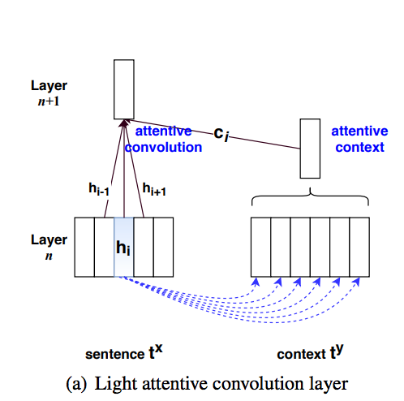

# tf-attentive-conv: Attentive Convolution

Han Xiao <artex.xh@gmail.com>

## What is it?
This is a Tensorflow implementation of Yin Wenpeng's paper "Attentive Convolution". [Wenpeng's original code](https://github.com/yinwenpeng/Attentive_Convolution) is written in Theano. 

I only implement the light attentive convolution described in Sect. 3.1 of the paper.

Run `app.py` for a simple test on toy data.